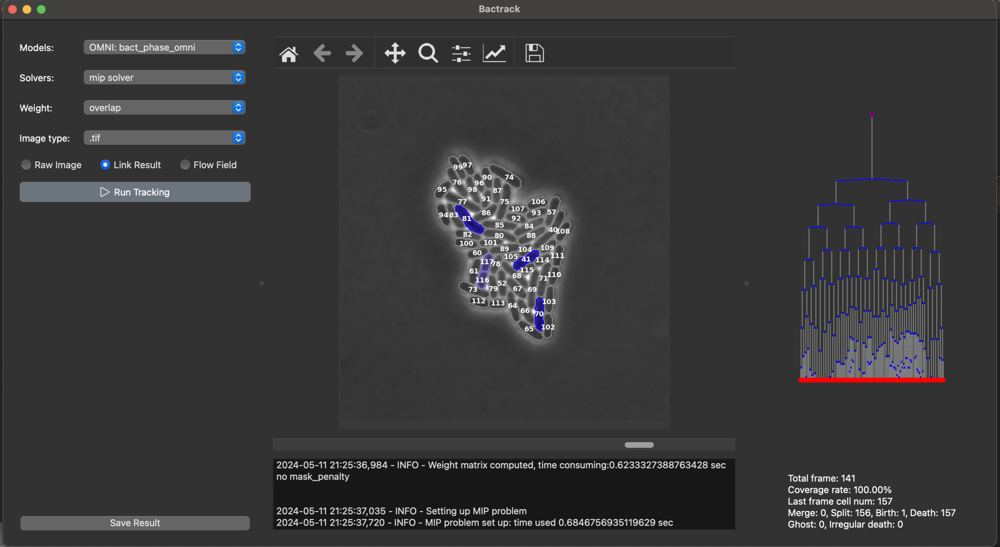

# BACTRACK


[](https://codecov.io/gh/yyang35/bactrack)


A cell tracker maximizing accuracy through diverse segmentation analysis and mixed integer programming optimization


## Introduction

Bactrack is inspired by [ultrack](https://github.com/royerlab/ultrack)([paper](https://arxiv.org/abs/2308.04526)). Bactrack uses segmentation hierarchy to allow various segmentation scenarios, and hierarchy is built on [Omnipose](https://github.com/kevinjohncutler/omnipose/) dynamic/pixel clustering [logic](https://www.nature.com/articles/s41592-022-01639-4),  and using MIP solver to assign cell from frame to frame by maximize [weights](https://github.com/yyang35/bactrack/tree/dev/bactrack/tracking/weights). 

For assignment algorithm, Bactrack includes following [MIP](https://en.wikipedia.org/wiki/Integer_programming) solvers: [HiGHS](https://highs.dev/), [CBC](https://www.coin-or.org/Cbc/cbcuserguide.html), [Gurobi](https://www.gurobi.com/solutions/gurobi-optimizer) for tracking assignment task. 
All of these MIP solver will return the same optimized global maximum result but with different run-time speed. For performance comparsion between MIP solvers check this [benchmark](https://plato.asu.edu/ftp/milp.html). 
 In short, the speed of Gurobi is the fastest **(Gurobi > HiGHS > CBC)**. 


( Those tools are not directly be used,  but through Python interface libraries: specifically: [Scipy.milp](https://docs.scipy.org/doc/scipy/reference/generated/scipy.optimize.milp.html)
for  HiGHS, and [python_mip](https://github.com/coin-or/python-mip) for CBC and Gurobi. So if you look at solvers name: MipSolver,ScipySolver, it's interface name rather than solver name)

Goes  [Bactrack Architecture Doc](doc/Architecture.md) for more details for Bactrack. 


## Installation

- ### Conda

  First, make sure you have Conda installed. You can find the installation instructions on the [Conda official documentation](https://docs.conda.io/projects/conda/en/latest/user-guide/install/index.html).
  
  clone this repo
  ```bash
  git clone https://github.com/yyang35/bactrack.git
  ```
  
  setup the enviroment and install package
  ```bash
  cd bactrack
  conda env create -f environment.yaml
  conda activate bactrack
  ```


## Usage 

- ### Run in Colab 
  For quick tastes of Bactrack (no need install it on your local), try this colAb notebook. 

- ### Run in Python Function 

  Examples of calling Bactrack functions includes in notebooks in the [examples](examples) folder. 
  You should start on [Basic Function Notebook](examples/basic_function.ipynb) to explore the useage 
  of core functions.  


- ### Run in GUI
  before you run it in GUI, you need install GUI dependences first.

  Make sure you are in bactrack env first, then install GUI dependeces by command:

  ```
  conda activate bactrack
  pip install git+https://github.com/yyang35/bactrack[GUI]
  ```

  and then you can start GUI by command:

  ```
  python bactrack/gui/gui.py
  ```


  


- ### Run in Shell Command:

  ``` bash
  python -m bactrack --basedir '[BASEDIR]' --outdir '[OUTPUTDIR]' --hypermodel omnipose --submodel bact_phase_omni --solver_name scipy_solver --weight_name overlap_weight
  ```

  Change the '[BASEDIR]' and '[OUTPUTDIR]' by the dirctory stores images you want to run tracking on, and the desired dirctory you want to output files in. 
  
  Also feel free to change the models, weights, solvers. Options for them are listed in following. (submodels options depending on which hypermodel you are choose, check [cellpose](https://www.cellpose.org/) and [omnipose](https://omnipose.readthedocs.io/) for more information what models they provide, but bactrack automically accept all those models).
  
    weights = [iou_weight, overlap_weight, distance_weight]\
    solvers = [scipy_solver, mip_solver]

##  Explore

- For **understanding how Bactrack works**, go to graphical architecture & framework  in [Bactrack Architecture Doc](doc/Architecture.md)

- For a more **advance setup**  check document [Advance Setup Doc](doc/AdanceSetup.md)