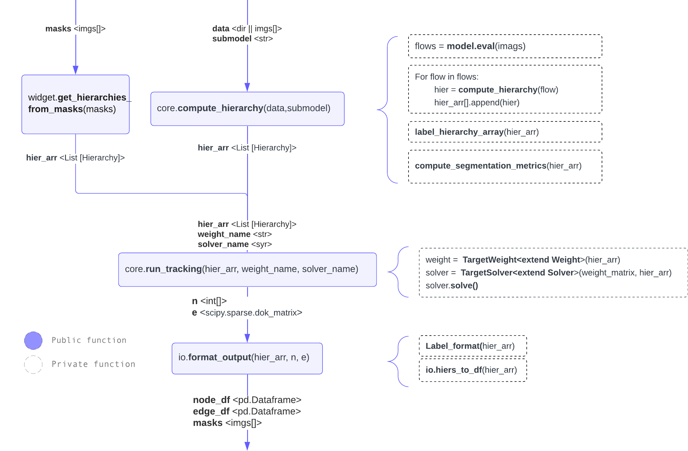
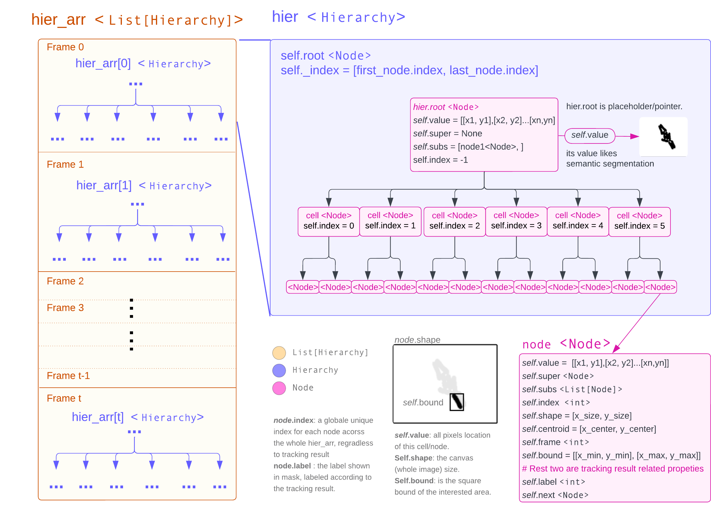

## Bactrack Architecture
Before go to architecture details, I want mention the following graphs are generate through [Bactrack Lucid Chart Project]().
The latest version might not be updated in here when you see it, feel free to check the chart project link for real-time version. 

### Workflow
They main feature of bactrack including two part: **Segmentation** (computing segmentation hierarchy), and **Tracking** (links cell in hierarchies by solving MIP problem).

 The flowing Workflow goes top-> down with 3 parts, segmentation, tracking, and io.format. On the top-left is a function for supporting generate segmentation hierarchy with masks arrays. Instead of using bactrack integrated segmentation tool (omnipose, cellpose), you could use your own segmentated result. (Just keep in mind, this will limit flexibility/robustness of Bactrack). 

### Datatypes
The segmentation part including 2 datatyps: **Class Hierarchy**, **Class Node**

The tracking part including 2 dataypes: **Class Weight**, **Class Solver**

